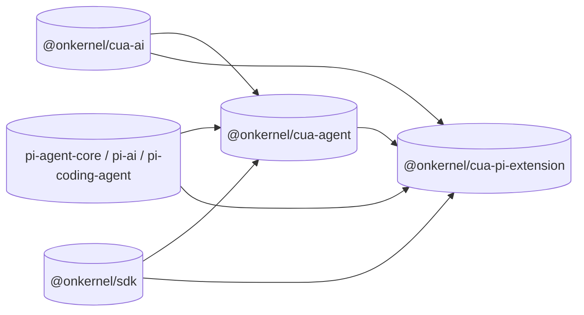

# cua

Browser tools for your agent, built on [pi](https://github.com/earendil-works/pi).

Point any model at a [Kernel cloud browser](https://kernel.sh/): pick the tools,
get plain agent objects back, and run whatever loop you already have.

```ts
import { attach } from "@onkernel/cua-agent";
import { cua } from "@onkernel/cua-ai";

const kb = attach({ client, browser });
const { model, agentTools, models } = kb.compile({
  model: "anthropic:claude-opus-5",
  tools: cua.toolsets.browser(),
});
```

Already in pi? Install the extension instead and keep pi's session, UI, and
model selection:

```bash
pi install npm:@onkernel/cua-pi-extension
pi -p --cua-tools browser,browser-act "open example.com and report the heading"
```

---

## Why this exists

Frontier models expose computer use through different protocols: native
computer/browser declarations, predefined browser action sets, ordinary function
tools, different coordinate systems, and different screenshot/result contracts.

All of them expect you to:

1. Run a real browser somewhere (locally is annoying, on a server is hard).
2. Translate every action into an actual SDK call against that browser.
3. Capture appropriate feedback from each action so the model can verify whether
   it had the intended effect.
4. Know which of those protocols the model you picked actually accepts.

This repo does all of that and stops there. `@onkernel/cua-ai` represents the
provider differences as an explicit, identity-keyed tool catalog; you choose the
exact tools, and provider transforms compose only the declarations and request
fields those identities require. It does not supply an agent class, a session
format, or a front-end — your framework already has those.

---

## Workspace

```
packages/
├── ai/            # @onkernel/cua-ai           - model catalog, tool schemas, provider adapters
├── agent/         # @onkernel/cua-agent        - Kernel-browser tool execution
├── pi-extension/  # @onkernel/cua-pi-extension - the same tools inside pi's own session
└── ptywright/     # @onkernel/ptywright        - development-only PTY/TUI test infrastructure
```

| Package | What it ships |
| --- | --- |
| [`@onkernel/cua-ai`](packages/ai) | Model catalog, tool factories/toolsets, per-model compatibility checks, provider adapters. |
| [`@onkernel/cua-agent`](packages/agent) | `attach()`: binds a Kernel browser and compiles a (model, tools) pair into plain pi objects. |
| [`@onkernel/cua-pi-extension`](packages/pi-extension) | A pi extension contributing those tools to pi's own agent session. |
| [`@onkernel/ptywright`](packages/ptywright) | Development-only PTY/TUI test infrastructure. |



---

## Building an agent

`attach()` binds the browser once; `compile()` turns a (model, tools) pair into
plain pi objects. Nothing here is a CUA type you have to learn:

```ts
import Kernel from "@onkernel/sdk";
import { cua } from "@onkernel/cua-ai";
import { Agent, attach } from "@onkernel/cua-agent";

const client = new Kernel({ apiKey: process.env.KERNEL_API_KEY! });
const browser = await client.browsers.create({ stealth: true });
const kb = attach({ client, browser });

const { model, agentTools, models } = kb.compile({
  model: "anthropic:claude-opus-5",
  tools: [...cua.toolsets.browser(), cua.tools.browser.act()],
});

const agent = new Agent({
  streamFn: (selected, context, options) => models.streamSimple(selected, context, options),
  initialState: { model, tools: [...agentTools], systemPrompt: "Use the supplied browser tools." },
});

try {
  await agent.prompt("Open example.com and report the heading.");
} finally {
  await kb.dispose();
  await client.browsers.deleteByID(browser.session_id);
}
```

The compiled `model` carries the transport its tools derive: selecting a
provider-native browser or computer surface can change `model.api`, so the pair
has to reach the agent together. See
[`packages/agent/README.md`](packages/agent/README.md) for the harness variant,
swapping tools on a running session, and tool contexts.

## Choosing tools for a model

Not every model accepts every tool. Ask, rather than guess:

```ts
import { cuaToolMenu, getCuaModel } from "@onkernel/cua-ai";

for (const entry of cuaToolMenu(getCuaModel("openai:gpt-5.6-sol"))) {
  console.log(entry.label, entry.available ? "ok" : `unavailable: ${entry.unavailableReason}`);
}
```

Availability is decided by compiling the candidate catalog, so the menu cannot
drift from what the compiler accepts, and the reason shown for an unavailable
tool is the compiler's own. It is also pairwise: two providers' native surfaces
cannot coexist, so rebuild the menu after each change rather than caching a
per-tool verdict.

---

## How it works

1. **Model layer** — `@onkernel/cua-ai` opens pi-ai's whole model catalog, with
   stable tool identities, explicit tool factories/toolsets, per-model
   compatibility checks, and provider declarations/headers/payload transforms.
   Compilation is declaration-only: it never sees an executor.
2. **Execution layer** — `@onkernel/cua-agent` materializes the caller's exact
   catalog over one shared resource pool and executes canonical actions through
   Kernel's computer API or a raw-CDP browser executor.
3. **Transport** — the compiled catalog derives `model.api` from the selected
   tools, so a provider-native surface reaches the wire with the transport,
   headers, and payload shape it requires.
4. **Browser** — a Kernel cloud browser with optional profile and proxy. The
   model requests screenshots explicitly when it needs visual feedback.

See [`docs/architecture.md`](docs/architecture.md) for the full end-to-end flow.

---

## Development

```bash
npm ci
npm run typecheck
npm test --workspace @onkernel/cua-ai
npm test --workspace @onkernel/cua-agent
npm test --workspace @onkernel/cua-pi-extension
```

`cua-agent`'s live end-to-end tests skip unless `CUA_E2E_LIVE=1` is set, and
`cua-ai` runs integration tests separately via `npm run test:integration`.

---

## License

MIT
