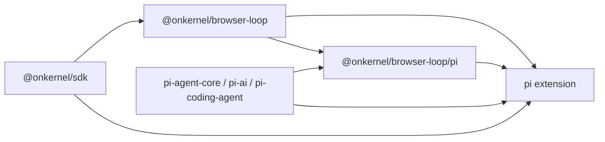

# browser loop

Browser tools for your agent. The agent can be a [pi](https://github.com/earendil-works/pi)
`Agent` or `AgentHarness` — or your coding harness through a plugin — with Eve and
AI SDK bindings anticipated next. Browser Loop supplies the tools, the
[Kernel cloud browser](https://kernel.sh/) they run against, and the per-model
compatibility knowledge.

Point any model at a Kernel browser: pick the tools, get plain agent objects
back, and run whatever loop you already have.

```ts
import { loop } from "@onkernel/browser-loop";
import { attach } from "@onkernel/browser-loop/pi";

const kb = attach({ client, browser });
const { model, agentTools, models } = kb.compile({
  model: "anthropic:claude-opus-5",
  tools: loop.toolsets.browser(),
});
```

The extension is the other half of the workflow: a harness is where you find
out which tools and which model actually work for a use case, and the SDK is
what you deploy into your production agent. Same catalog, same tool identities,
same model knowledge on both sides, so the hand-off is lossless:

```bash
pi install npm:@onkernel/browser-loop
pi -p --browser-tools browser,browser-act "open example.com and report the heading"
```

---

## Why this exists

Frontier models expose computer use through different protocols: native
computer/browser declarations, predefined browser action sets, ordinary function
tools, different coordinate systems, and different screenshot/result contracts.

All of them expect you to:

1. Run a real browser somewhere (locally is annoying, on a server is hard).
2. Translate every action into an actual SDK call against that browser.
3. Capture appropriate feedback from each action so the model can verify whether
   it had the intended effect.
4. Know which of those protocols the model you picked actually accepts.

This repo does all of that and stops there. `@onkernel/browser-loop` represents the
provider differences as an explicit, identity-keyed tool catalog; you choose the
exact tools, and provider transforms compose only the declarations and request
fields those identities require. It does not supply an agent class, a session
format, or a front-end — your framework already has those. Tool identities
(`kloop.*.v1`) and model-facing names are byte-identical across bindings, so
transcripts and evals stay comparable wherever the same catalog runs.

---

## Workspace

```
packages/
├── browser-loop/  # @onkernel/browser-loop   - framework-neutral core, pi binding, pi extension
└── ptywright/  # @onkernel/ptywright - development-only PTY/TUI test infrastructure
```

| Entry point | What it ships |
| --- | --- |
| `@onkernel/browser-loop` | The framework-neutral core: canonical actions, tool factories/toolsets, catalog compilation, the tool menu, and Kernel-browser execution. Imports nothing from pi — a unit test enforces the boundary. |
| `@onkernel/browser-loop/pi` | The pi binding — the first of the framework bindings (`./eve` and `./ai-sdk` are the anticipated next). `attach()` binds a Kernel browser and compiles a (model, tools) pair into plain pi objects, plus model resolution and provider adapters. |
| `pi.extensions` | A pi extension contributing those tools to pi's own agent session. |
| [`@onkernel/ptywright`](packages/ptywright) | Development-only PTY/TUI test infrastructure. |



---

## Building an agent

`attach()` binds the browser once; `compile()` turns a (model, tools) pair into
plain pi objects. Nothing here is a Browser Loop-specific type you have to learn:

```ts
import Kernel from "@onkernel/sdk";
import { Agent } from "@earendil-works/pi-agent-core";
import { loop } from "@onkernel/browser-loop";
import { attach } from "@onkernel/browser-loop/pi";

const client = new Kernel({ apiKey: process.env.KERNEL_API_KEY! });
const browser = await client.browsers.create({ stealth: true });
const kb = attach({ client, browser });

const { model, agentTools, models } = kb.compile({
  model: "anthropic:claude-opus-5",
  tools: [...loop.toolsets.browser(), loop.tools.browser.act()],
});

const agent = new Agent({
  streamFn: (selected, context, options) => models.streamSimple(selected, context, options),
  initialState: { model, tools: [...agentTools], systemPrompt: "Use the supplied browser tools." },
});

try {
  await agent.prompt("Open example.com and report the heading.");
} finally {
  await kb.dispose();
  await client.browsers.deleteByID(browser.session_id);
}
```

The compiled `model` carries the transport its tools derive: selecting a
provider-native browser or computer surface can change `model.api`, so the pair
has to reach the agent together. See
[`packages/browser-loop/README.md`](packages/browser-loop/README.md) for the harness variant,
swapping tools on a running session, and tool contexts.

## Choosing tools for a model

Not every model accepts every tool. Ask, rather than guess:

```ts
import { loopToolMenu } from "@onkernel/browser-loop";
import { getLoopModel } from "@onkernel/browser-loop/pi";

for (const entry of loopToolMenu(getLoopModel("openai:gpt-5.6-sol"))) {
  console.log(entry.label, entry.available ? "ok" : `unavailable: ${entry.unavailableReason}`);
}
```

Availability is decided by compiling the candidate catalog, so the menu cannot
drift from what the compiler accepts, and the reason shown for an unavailable
tool is the compiler's own. It is also pairwise: two providers' native surfaces
cannot coexist, so rebuild the menu after each change rather than caching a
per-tool verdict.

---

## How it works

1. **Execution layer** — `@onkernel/browser-loop` materializes the caller's exact
   catalog over one shared resource pool and executes canonical actions through
   Kernel's computer API or a raw-CDP browser executor.
2. **Model layer** — `@onkernel/browser-loop/pi` opens pi-ai's whole model catalog and
   composes provider declarations, headers, and payload transforms around that
   core. Catalog compilation is declaration-only: it never sees an executor.
3. **Transport** — the compiled catalog derives `model.api` from the selected
   tools, so a provider-native surface reaches the wire with the transport,
   headers, and payload shape it requires.
4. **Browser** — a Kernel cloud browser with optional profile and proxy. The
   model requests screenshots explicitly when it needs visual feedback.

See [`docs/architecture.md`](docs/architecture.md) for the full end-to-end flow.

---

## Development

```bash
npm ci
npm run typecheck
npm run build --workspace @onkernel/browser-loop
npm test --workspace @onkernel/browser-loop
```

Build before testing: the pi print/RPC test loads the extension the way pi does,
through the package's own entry points. Live end-to-end tests skip unless
`LOOP_E2E_LIVE=1` is set, and integration tests run separately via
`npm run test:integration`.

---

## License

MIT
