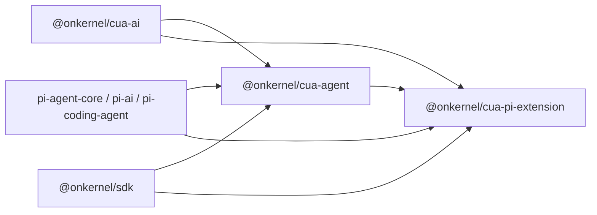

# Architecture

This document explains how `cua` is wired together for contributors and
integrators.

## Product principles

Kernel packages own the repetitive browser plumbing: browser-session wiring,
provider payload quirks, coordinate conversion, action execution, and action
feedback. They do **not** choose an agent's tools or system prompt. Callers own
both explicitly and may use pi's orchestration primitives directly.

## Package boundaries

- `@onkernel/cua-ai` owns the model catalog, stable tool identities, tool
  factories/toolsets, provider declarations, compatibility validation, headers,
  payload transforms, and incoming native-call normalization. Catalog
  compilation is declaration-only and deterministic; the package has no
  `AgentTool` or materialization types and no `pi-agent-core` dependency.
- `@onkernel/cua-agent` is provider-neutral runtime glue around
  `pi-agent-core`. It defines `CuaAgentTool`, materializes catalog specs
  exactly once per shared resource pool against a Kernel browser, owns shared
  execution resources, and applies catalog plans supplied as data.
- `@onkernel/cua-pi-extension` contributes these tools to a pi session that pi
  itself owns. It is the one consumer that uses neither `attach()` nor the
  harness: pi owns the model collection and the agent loop, so the extension
  takes the two pieces that are not pi-shaped — the catalog compiler and
  `CuaExecutionResources` — and applies headers and payload transforms through
  pi's own `before_provider_headers` and `before_provider_request` hooks.
- `@onkernel/ptywright` is development-only PTY/TUI test infrastructure. It has
  no in-repo consumer since the CLI was retired; its own tests are what exercise
  it.

The invariant is that `packages/agent/src` contains no provider-name branches.
Adding provider behavior means adding data and transforms in `cua-ai`, not a
conditional in `cua-agent`.



## Explicit tool catalog

`cua-ai` exposes one frozen namespace:

```ts
import { cua } from "@onkernel/cua-ai";

const tools = [
  cua.tools.browser.snapshot(),
  cua.tools.browser.click(),
  cua.tools.computer.screenshot(),
];
```

The main groups are:

- `cua.tools.browser.*`: CDP/page tools, using element refs and viewport pixels.
- `cua.tools.computer.*`: Kernel OS input/read tools, using pixel coordinates by
  default.
- `cua.tools.playwright()`: a Playwright code execution tool.
- `cua.toolsets.browser()`, `computer()`, and `mixed()`: ordinary convenience
  arrays of CUA-authored tools.
- `cua.providers.*`: only provider-native tools and predefined toolsets backed
  by linked first-party documentation. Each provider namespace exposes its
  `source` (or versioned `sources`), and every returned spec carries that URL.

Each CUA-owned tool has a stable identity independent of its caller-visible
name. Compilation preserves requested order and derives provider-safe names,
schema fingerprints, coordinate contracts, loading eligibility,
headers, payload transforms, and native input mappings. Duplicate identities,
name collisions, transform conflicts, and model/tool incompatibilities fail
before a model request.

## Dynamic catalogs

`attach()` returns a handle; `compile()` turns a (model, tools) pair into plain
pi objects, and `apply()` swaps a running harness onto a new pair:

```ts
const kb = attach({ browser, client });
const compiled = kb.compile({ model, tools });
await compiled.apply(harness);
```

Nothing mutates in place: a change compiles a new pair, and `compile()` throws
before anything reaches pi. Existing tool
identity with a changed schema, executor, or coordinates counts as a real
replacement. Additions made from inside a running tool are recorded in pi's
Anthropic-compatible `addedToolNames` marker only when that provider/model can
defer ordinary function tools. Additions outside a tool call are eager.
Provider-native tools are always eager.

Model changes revalidate the entire requested catalog; incompatible
combinations fail without partial mutation.

## Shared execution resources

A single `CuaExecutionResources` pool is created per agent/harness and survives
catalog and model changes. It owns:

- the Kernel client and browser handle;
- one canonical computer translator;
- one lazily created raw-CDP `BrowserExecutor`;
- browser element-ref and frame state;
- screenshot and Playwright execution capabilities.

This prevents `setTools()` from resetting refs, tabs, browser state, or caches.
Tools are materialized as small adapters over that shared pool, exactly once
per spec object.

## Action planes and result feedback

Canonical actions live under `packages/ai/src/actions/`:

- **Computer actions** use Kernel's `browsers.computer` API and OS screenshot
  coordinates.
- **Browser actions** use `packages/agent/src/translator/browser.ts` over the
  browser's raw CDP websocket. Element refs are snapshot-scoped and stale refs
  fail with a request to snapshot again.

Tools return only the result requested by the model:

- Write actions return concise success text.
- Read actions return their requested text or structured data.
- Screenshot and zoom actions return images.
- `browser_act` returns causal outcomes and a bounded successor diff.
- Failed batches replace images captured by earlier explicit screenshot steps
  with textual markers.

## Mechanical batches

`computer_batch` and `browser_batch` are bounded lists of primitive actions.
They do not contain a workflow DSL, references, branching, or saved values.

Computer batches coalesce consecutive writes into Kernel batch calls and flush
around reads so results stay ordered. Browser batches execute sequentially over
the shared `BrowserExecutor`, so refs from a snapshot can be consumed later in
the same batch. Failure stops at the first failing action and reports the failed
index, completed read results, and skipped count.

## Provider composition

Catalog compilation composes provider behavior rather than replacing the whole
catalog:

- Ordinary function tools stay ordinary.
- Anthropic native browser/computer declarations replace only their own
  placeholders and merge required beta headers with caller headers.
- OpenAI streams through pi's builtin Responses transport and its automatic
  prompt caching by default; a CUA-owned adapter handles OpenAI's native
  computer tool and tool-search namespace round-trips.
- Anthropic's native browser tool falls back to an equivalent function-tool
  declaration when the active credential cannot access `browser_20260701`;
  the selected tool identity, name, schema, and executor remain unchanged.
- Google's current predefined browser toolset serializes one `computer_use`
  declaration plus exact exclusions through the CUA-owned Interactions API
  adapter. Excluded calls fail with a named catalog error instead of reaching
  generic tool dispatch.
- Meta, xAI, and Moonshot disable parallel tool calls when the selected catalog
  can mutate browser state.

### Transport derivation

The transport a model streams through is a function of **(model, selected
tools)**, derived at catalog compilation — never stamped on the model ahead of
time and never branched on a provider name. A `CuaProviderBinding` may declare
`requiresApi`: the api id its provider-native tool needs. `compileCuaToolCatalog`
reads `requiresApi` off the selected bindings after normalizing the requested
catalog and returns a `catalog.model` carrying that api; selecting tools whose
bindings require different transports fails to compile with a named catalog
error. A model resolved with no such tool selected keeps its ordinary registry
api.

This is why an OpenAI model selected with only CUA browser tools streams
through pi's builtin `openai-responses` transport, but the same model selected
with `cua.providers.openai.tools.computer()` compiles to the CUA-owned
`openai-cua-computer` api — and symmetrically for Google's
`google-cua-interactions` Interactions API versus pi's builtin Google
transport.

### The tool menu

`cuaToolMenu(model, selected)` in `packages/ai/src/menu.ts` returns every tool
CUA can offer for a model, each marked available or not. It decides availability
by compiling the candidate catalog rather than by restating the compiler's
rules, so the menu cannot drift from what `compileCuaToolCatalog` accepts: an
entry is available exactly when selecting it compiles. Compilation is pure and
declaration-only, so probing it per entry is cheap and side-effect-free.

Availability is relative to the current selection, because several rules are
pairwise: two providers' native surfaces cannot coexist, and a native surface
derives a transport that the rest of the selection must be compatible with.
Callers rebuild the menu after each staged change rather than caching a per-tool
verdict.

`apply()` pushes the compiled `catalog.model` into pi alongside its tools, and
only when the derived transport actually moved, so a tools-only change records
no model change while a transport-moving change records exactly one.

pi fixes a harness's `models` at construction, but the headers, payload
transforms, and incoming tool plan it applies are per-catalog. The handle
therefore owns one `Models` collection that serves whichever pair was last
activated; `activate()` is what redirects it, and `apply()` calls it.

Generated payload processing has fixed order: model preparation, tool
serialization, provider fields, then the caller's `onPayload` hook.

## Extension composition

`packages/pi-extension/src/index.ts` is the composition root for pi sessions. pi
owns the agent loop, session, UI, and model selection; the extension contributes
only what Kernel owns:

1. registers every selectable tool as a pi tool, and keeps the model-facing
   names identical to what the library produces;
2. resolves a selection from `--cua-tools` (or a persisted command selection),
   and validates it by compiling for the active model, so an incompatible tool
   deactivates with the compiler's own reason instead of failing at request time;
3. re-validates on `model_select` and `before_agent_start`, restoring a
   previously forced-off selection when the new model can take it;
4. applies the catalog's headers and payload transforms through
   `before_provider_headers` and `before_provider_request`;
5. owns the stream for the providers it registers, swapping pi's resolved model
   for the compiled `catalog.model` and adding the incoming native-call plan;
6. provisions one browser lazily on first tool execution, and deletes it on
   shutdown if this session created it.

Step 5 is what makes provider-native surfaces work under a host that owns model
resolution. `catalog.model` is the resolved model with only `api` replaced, so
cost and context window are preserved, and the transport a native surface derives
is what reaches the wire. Any future framework binding needs the same seam: a
place to register a provider whose stream receives the compiled model.

Compiling is declaration-only, so steps 2 through 5 never provision a browser.
Only step 6 does.

## Per-turn flow

```text
user prompt
  -> pi agent loop
     -> active identity-keyed catalog
     -> generated headers and payload transforms
     -> caller onPayload
     -> provider stream
     -> incoming native/function call normalization
     -> shared CuaExecutionResources
        -> Kernel computer API or raw-CDP BrowserExecutor
     -> policy-specific action result
     -> transcript + TUI/stdout/JSONL
```

## Validation and test ownership

- `packages/ai/test/tool-catalog.test.ts`: identities, collisions, provider
  composition, compatibility, declarations, and coordinate contracts.
- `packages/agent/test/resources.test.ts`: action feedback and batch boundaries.
- `packages/agent/test/attach.test.ts` and `attach-session.test.ts`: compiled
  pairs, applying one to a running harness, and the behaviors `activate()`
  installs.
- `packages/agent/test/translator-browser.test.ts`: browser behavior and ref
  lifecycle.
- `packages/pi-extension/test/`: selection and availability, provider stream
  ownership, browser lifecycle, and an end-to-end run against real `pi` in print
  and RPC modes.
