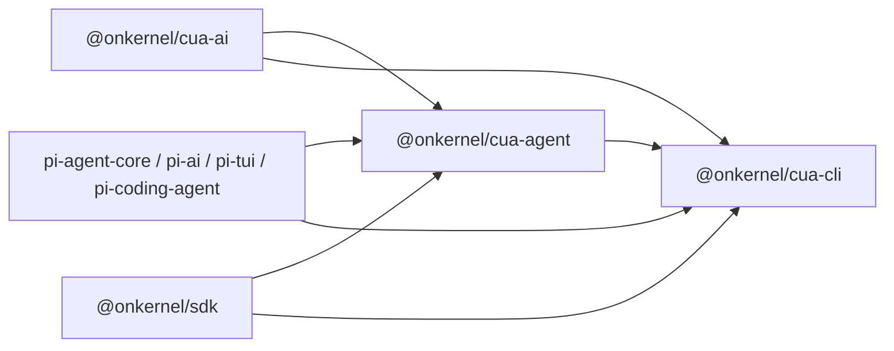

# Architecture

This document explains how `cua` is wired together for contributors and
integrators.

## Product principles

Kernel packages own the repetitive browser plumbing: browser-session wiring,
provider payload quirks, coordinate conversion, action execution, and action
feedback. They do **not** choose an agent's tools or system prompt. Callers own
both explicitly and may use pi's orchestration primitives directly.

## Package boundaries

- `@onkernel/cua-ai` owns the model catalog, stable tool identities, tool
  factories/toolsets, provider declarations, compatibility validation, headers,
  payload transforms, and incoming native-call normalization.
- `@onkernel/cua-agent` is provider-neutral runtime glue around
  `pi-agent-core`. It materializes catalog entries against a Kernel browser,
  owns shared execution resources, and applies catalog plans supplied as data.
- `@onkernel/cua-cli` owns application policy: it chooses an explicit tool list
  for each selected model, adds pi coding tools, supplies the system prompt,
  resolves credentials/sessions/skills, and renders text, JSONL, or TUI output.
- `@onkernel/ptywright` is development-only PTY/TUI test infrastructure.

The invariant is that `packages/agent/src` contains no provider-name branches.
Adding provider behavior means adding data and transforms in `cua-ai`, not a
conditional in `cua-agent`.



## Explicit tool catalog

`cua-ai` exposes one frozen namespace:

```ts
import { cua } from "@onkernel/cua-ai";

const tools = [
  cua.tools.browser.snapshot(),
  cua.tools.browser.click(),
  cua.tools.computer.screenshot(),
];
```

The main groups are:

- `cua.tools.browser.*`: CDP/page tools, using element refs and viewport pixels.
- `cua.tools.computer.*`: Kernel OS input/read tools, using pixel coordinates by
  default.
- `cua.tools.playwright()`: a Playwright code execution tool.
- `cua.toolsets.browser()`, `computer()`, and `mixed()`: convenience lists only;
  they do not imply a runtime mode.
- `cua.providers.*`: provider-native tools and predefined toolsets.

Each CUA-owned tool has a stable identity independent of its caller-visible
name. Compilation preserves requested order and derives provider-safe names,
schema/executor fingerprints, coordinate contracts, loading eligibility,
headers, payload transforms, and native input mappings. Duplicate identities,
name collisions, transform conflicts, and model/tool incompatibilities fail
before a model request.

## Dynamic catalogs

`CuaAgent` and `CuaAgentHarness` use composition around pi and expose:

```ts
agent.getTools();
agent.setTools(nextTools);
agent.inspectTools();
agent.setModel(nextModel);
```

`setTools()` recompiles atomically before mutating pi state. Existing tool
identity with a changed schema, executor, or coordinates counts as a real
replacement. Additions made from inside a running tool are recorded in pi's
Anthropic-compatible `addedToolNames` marker only when that provider/model can
defer ordinary function tools. Additions outside a tool call are eager.
Provider-native tools are always eager.

The transcript stores pi's active-tool change entries, so catalog transitions
remain visible in session history. Model changes revalidate the entire requested
catalog; incompatible combinations fail without partial mutation.

## Shared execution resources

A single `CuaExecutionResources` pool is created per agent/harness and survives
catalog and model changes. It owns:

- the Kernel client and browser handle;
- one canonical computer translator;
- one lazily created raw-CDP `BrowserExecutor`;
- browser element-ref and frame state;
- screenshot and Playwright execution capabilities.

This prevents `setTools()` from resetting refs, tabs, browser state, or caches.
Tools are materialized as small adapters over that shared pool.

## Action planes and result feedback

Canonical actions live under `packages/ai/src/actions/`:

- **Computer actions** use Kernel's `browsers.computer` API and OS screenshot
  coordinates.
- **Browser actions** use `packages/agent/src/translator/browser.ts` over the
  browser's raw CDP websocket. Element refs are snapshot-scoped and stale refs
  fail with a request to snapshot again.

Result feedback is tool-policy data compiled by `cua-ai`:

- Browser mechanical writes return a viewport screenshot.
- Computer mechanical writes return an OS screenshot.
- Explicit read actions return their requested data without a fallback image.
- Yutori native calls return text only; its request transform injects one fresh
  1280×800 screenshot into the latest outgoing provider message.
- Failed actions never capture a new screenshot. Any images from successful
  earlier actions in the same failing batch are replaced by textual markers.

## Mechanical batches

`computer_batch` and `browser_batch` are bounded lists of primitive actions.
They do not contain a workflow DSL, references, branching, or saved values.

Computer batches coalesce consecutive writes into Kernel batch calls and flush
around reads so results stay ordered. Browser batches execute sequentially over
the shared `BrowserExecutor`, so refs from a snapshot can be consumed later in
the same batch. Failure stops at the first failing action and reports the failed
index, completed read results, and skipped count.

## Provider composition

Catalog compilation composes provider behavior rather than replacing the whole
catalog:

- Ordinary function tools stay ordinary.
- Anthropic native browser/computer declarations replace only their own
  placeholders and merge required beta headers with caller headers.
- OpenAI native computer uses a CUA-owned Responses adapter and can coexist with
  ordinary functions.
- Tzafon replaces only the selected computer identity and fills declaration
  dimensions from the actual viewport.
- Anthropic's native browser tool falls back to an equivalent function-tool
  declaration when the active credential cannot access `browser_20260701`;
  the selected tool identity, name, schema, and executor remain unchanged.
- Google current and legacy predefined browser toolsets serialize one
  `computer_use` declaration plus exact exclusions through the CUA-owned
  Interactions API adapter. Current declarations exclude unselected names from
  both published vocabularies because Gemini 3 preview endpoints can still
  surface legacy names; excluded calls fail with a named catalog error instead
  of reaching generic tool dispatch. Action sets and coordinate contracts
  remain version-specific.
- Yutori emits its native `tool_set`/`disable_tools` fields while preserving
  custom functions and adds a fresh screenshot to each request.
- Meta, xAI, and Moonshot disable parallel tool calls when the selected catalog
  can mutate browser state.

Generated payload processing has fixed order: model preparation, tool
serialization, provider fields, screenshot injection, then the caller's
`onPayload` hook.

## CLI composition

`packages/cli/src/harness.ts` is the application composition root. It:

1. resolves the provider-qualified model;
2. chooses `defaultInteractionTools(model)` explicitly:
   - CUA browser tools for OpenAI, Meta, xAI, Moonshot, and Anthropic models
     without native-browser support;
   - Anthropic's native browser tool when the model supports it;
   - Google's native browser action set;
   - Tzafon's native computer tool configured for a browser;
   - Yutori's native N1 or N1.5 browser set;
3. appends `createCodingTools(cwd)` to that same list;
4. passes the complete list to `CuaAgentHarness`;
5. builds a caller-owned prompt from loaded skills and context files;
6. uses one `Session` for transcript persistence and resume.

## Per-turn flow

```text
user prompt
  -> CuaAgentHarness / pi agent loop
     -> active identity-keyed catalog
     -> generated headers and payload transforms
     -> caller onPayload
     -> provider stream
     -> incoming native/function call normalization
     -> shared CuaExecutionResources
        -> Kernel computer API or raw-CDP BrowserExecutor
     -> policy-specific action result
     -> transcript + TUI/stdout/JSONL
```

## Validation and test ownership

- `packages/ai/test/tool-catalog.test.ts`: identities, collisions, provider
  composition, compatibility, declarations, and coordinate contracts.
- `packages/agent/test/resources.test.ts`: action feedback and batch boundaries.
- `packages/agent/test/agent.test.ts`: exact catalogs and dynamic replacement.
- `packages/agent/test/translator-browser.test.ts`: browser behavior and ref
  lifecycle.
- `packages/cli/test/`: explicit CLI assembly, sessions, actions, and TUI flows.
