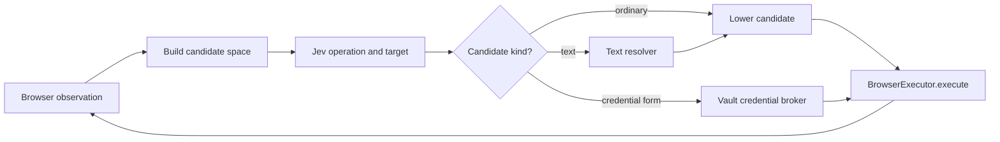

# Jev browser agent loop

This example runs a custom browser-agent loop with TypeSafe AI's Jev. It does not register Jev as a chat-model provider or expose Browser Loop tools to Jev. Code observes viewport-visible controls, enumerates a bounded candidate space, asks Jev to choose an operation and target, and executes that target through `BrowserExecutor`.

The loop uses:

- page-specific `CLICK`, `TYPE_TEXT`, `SELECT`, `USE_CREDENTIALS`, `SCROLL`, and `WAIT` candidates;
- speculative operation and target questions in one System One request;
- logical credential-form extraction with value-redacted password and OTP state;
- a small text-model escape hatch only after Jev selects a non-credential field or navigation operation;
- code-owned target guards, step limits, and repeated-no-change detection;
- `DONE` and `BLOCKED` as explicit Jev choices.

Navigation is part of the loop. The runner opens a blank tab before starting; startup pages expose only navigation and terminal candidates. Jev sees the goal plus the current URL, title, text, elements, values, and recent actions, then chooses `NAVIGATE`. Literal URLs in the task become bounded candidates. Otherwise the text resolver produces the destination URL.

## Data flow



The two action layers have different responsibilities:

| Layer | Responsibility |
| --- | --- |
| `JevCandidateSpace` | Dynamic semantic choices that make sense on the current page |
| `BrowserAction` / `BrowserActStep` | Fixed Browser Loop execution protocol |

Examples:

| Jev candidate | Browser Loop execution |
| --- | --- |
| Click Search | target guard, then `browser_click` at its current viewport point |
| Type in From | text resolver, guarded click, `CTRL+A`, then `browser_type` |
| Use credentials for Sign in | Jev vault-item choice, optional HITL collection, then grouped Vault `fill` |
| Select Business | guarded native-select update |
| Navigate | `browser_navigate` |
| Done / blocked | no browser action |

## Run

Requirements:

- Node.js 22+
- `KERNEL_API_KEY`
- `TYPESAFE_API_KEY`
- `TEXT_MODEL_API_KEY` for tasks that require navigation inference or text entry
- optional `KERNEL_VAULT` to enable credential-form actions against that project-scoped vault

The text helper uses an OpenAI-compatible `/chat/completions` endpoint. It limits responses to 1,024 tokens and retries once when a provider returns malformed JSON, before any browser mutation:

```bash
export TEXT_MODEL_API_KEY="$OPENAI_API_KEY"
export TEXT_MODEL_BASE_URL="https://api.openai.com/v1"
export TEXT_MODEL="gpt-5.4-nano"
# Defaults to none. Use low, medium, or high; provider omits the setting.
export TEXT_MODEL_REASONING="none"
```

Install the repository dependencies, then the example's isolated Jev dependency:

```bash
# Repository root
npm ci

cd packages/browser-loop/examples/jev-system-one
npm ci
npm run typecheck
npm test

npm run run -- \
  --task "Open https://news.ycombinator.com, then open the newest submissions page using the new link"
```

Set `KERNEL_VAULT` to an existing or new vault name to enable credential handling. The runner links that vault when it creates the browser, because browser-vault links are immutable. Jev receives every credential item object returned by the Vault API, whose contract omits sensitive values, plus the current URL, title, and extracted form. It may select an existing item, create one credential item for the current visible form, or decline a safe match.

```bash
export KERNEL_VAULT="browser-agent"
npm run run -- --task "Open https://example.com/login and sign in"
```

When a new or incomplete item needs user input, the runner opens the time-limited Kernel collection form and waits for the item to become ready. The collection URL and field values are excluded from Jev history and progress logs. Password, OTP, and vault-mapped browser controls expose only `has_value` to Jev, never their raw DOM values.

Run the opt-in live form detector against 15 public login pages and three negative controls with `npm run smoke:credentials`. It requires `KERNEL_API_KEY`, creates one temporary browser, does not submit any form, and fails on missed forms, false positives, exposed credential-field values, or per-field actions that bypass the grouped Vault action.

### Install into a browser REPL

The browser process API and REPL share a filesystem. This CLI flow downloads the prebuilt agent module to `/tmp/browser-loop/jev-agent.mjs`, defines `runJev` once, and reuses it in a later REPL call:

```bash
BROWSER_ID=$(kernel browsers create --timeout 600 -o json | jq -r .session_id)

kernel browsers process exec "$BROWSER_ID" --timeout 300 -- \
  curl -fsSL https://raw.githubusercontent.com/kernel/browser-loop/main/packages/browser-loop/examples/jev-system-one/install-repl.sh \| bash

cat <<JS | kernel browsers repl "$BROWSER_ID"
process.env.TYPESAFE_API_KEY = $(node -p 'JSON.stringify(process.env.TYPESAFE_API_KEY)');
var { createJevAgent } = await import("/tmp/browser-loop/jev-agent.mjs");
var runJev = createJevAgent();
JS

cat <<'JS' | kernel browsers repl "$BROWSER_ID" --timeout-sec 300
var task = await runJev(
  "Open https://news.ycombinator.com, click the new link, and finish once the newest submissions page is visible"
);
repl.write(JSON.stringify({
  status: task.status,
  reason: task.reason,
  steps: task.steps.length,
}));
JS
```

Set `BROWSER_LOOP_REF` to install another branch, tag, or commit, and `BROWSER_LOOP_REPL_INSTALL_DIR` to change the output directory. When `TEXT_MODEL_API_KEY` is present in the REPL, `createJevAgent()` also enables the text resolver used for inferred navigation and text entry.

There is intentionally no `--url` argument. The runner opens a blank tab, then initial navigation is selected and executed by the agent loop. The command prints the browser's live-view URL, step timings, and a compact final result to stderr. On macOS, interactive terminal runs also open the live view in the default browser.

```text
live view: https://...
[step 1] jev=184ms model=jev-1.13.0 tokens=812/34 operation=99% NAVIGATE "Navigate to https://example.com/"
[step 1] freshness=91ms changed=false
[step 1] action=927ms resolve=0ms execute=701ms observe=226ms NAVIGATE "Navigate to https://example.com/" changed=true url=https://example.com/
[step 2] jev=156ms model=jev-1.13.0 tokens=1041/41 operation=96% target=91% CLICK "Click link More information"
[result] status=completed elapsed=1487ms steps=2 url=https://example.com/more reason="Jev found visible completion evidence"
```

Jev timing covers only the System One request. Freshness timing is a target-specific identity and state check rather than another complete observation. Action timing is split into optional text resolution, browser execution, and the single successor observation. Single-step interactions use direct browser primitives with a 10-second deadline; a timeout stops the loop with an unknown execution outcome. `WAIT` retains navigation-safe `browser_act` execution, whose passive-wait path uses one baseline and one successor observation.

## Jev request

Jev receives more than the candidate labels. Every question is conditioned on structured state:

```json
{
  "goal": "Open Google Flights and search from SFO to JFK",
  "page": {
    "url": "about:blank",
    "title": "",
    "text": ""
  },
  "elements": [],
  "credential_forms": [],
  "recent_actions": []
}
```

The operation question contains only currently available operations. Target questions are added for operations with multiple candidates. Jev answers those questions speculatively in the same request; the loop consumes only the target for the selected operation.

## Files

- `agent.ts`: observe/choose/lower/execute loop and safety bounds
- `actions.ts`: page-specific candidate construction
- `browser.ts`: `BrowserExecutor` adapter, target validation, and execution
- `snapshot.ts`: viewport control and text observation
- `credentials.ts`: visible credential-form extraction, redaction, and selector preparation
- `models.ts`: Jev System One operation and target policy
- `vault-models.ts`: Jev credential-item selection and field mapping
- `vault.ts`: Kernel Vault collection, polling, and grouped fill
- `text.ts`: optional OpenAI-compatible string resolver
- `run.ts`: Kernel browser setup and CLI
- `repl.ts`: persistent-REPL agent factory
- `build-repl.mjs`: deterministic bundle and checksum generator
- `jev-agent.mjs`: generated single-file REPL module
- `install-repl.sh`: checksum-verifying process-exec installer

## Current boundaries

This is deliberately a custom example rather than a generalized policy API. Its observation pass includes only controls whose center is inside the current viewport, records each control's executable operations from its underlying DOM element, and assigns a stable identity for the life of the document. When a visible cross-origin frame is present, it supplements that state with the frame controls from Browser Loop's stitched accessibility observation. Before input, the runtime validates only the selected control's identity and state. A stale target causes a fresh observation and policy decision; snapshot-scoped references are not remapped.

Editable controls expose separate `TYPE_TEXT` and `Open …` click candidates so Jev can distinguish entering a literal from opening an autocomplete or picker. When Vault support is enabled, fields in a detected credential form expose only its grouped `USE_CREDENTIALS` action; sign-in goals prioritize that action before ordinary page operations. Credential fields are grouped by their native form or nearest primary authentication action. Main-document credential fields can be filled through Kernel Vaults; cross-origin accessibility-only and shadow-DOM fields remain observable but do not receive vault candidates because the fill API requires document CSS selectors.

The example does not generate prose answers, handle CAPTCHA, or upload files. The viewport candidate list is bounded to 250 grounded actions. Page text is treated as untrusted data, and the text resolver returns `null` when required information is absent. Vault fill failures and unknown outcomes are not automatically retried.
