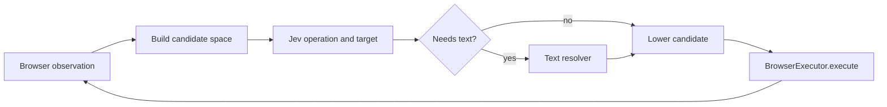

# Jev browser agent loop

This example runs a custom browser-agent loop with TypeSafe AI's Jev. It does not register Jev as a chat-model provider or expose Browser Loop tools to Jev. Code observes the browser, enumerates a bounded candidate space, asks Jev to choose an operation and target, lowers that candidate to a canonical Browser Loop action, and executes it through `BrowserExecutor`.

The loop uses:

- page-specific `CLICK`, `TYPE_TEXT`, `SELECT`, `SCROLL`, and `WAIT` candidates;
- speculative operation and target questions in one System One request;
- a small text-model escape hatch only after Jev selects a field or navigation operation;
- code-owned freshness checks, step limits, and repeated-no-change detection;
- `DONE` and `BLOCKED` as explicit Jev choices.

Navigation is part of the loop. A new browser starts on `about:blank` or an internal `chrome://` new-tab page; those startup pages expose only navigation and terminal candidates. Jev sees the goal plus the current URL, title, text, elements, values, and recent actions, then chooses `NAVIGATE`. Literal URLs in the task become bounded candidates. Otherwise the text resolver produces the destination URL.

## Data flow



The two action layers have different responsibilities:

| Layer | Responsibility |
| --- | --- |
| `JevCandidateSpace` | Dynamic semantic choices that make sense on the current page |
| `BrowserAction` / `BrowserActStep` | Fixed Browser Loop execution protocol |

Examples:

| Jev candidate | Browser Loop execution |
| --- | --- |
| Click Search | `browser_act` with `{ type: "click", ref }` |
| Type in From | text resolver, then `browser_act` with `{ type: "fill", ref, value }` |
| Select Business | `browser_act` with `{ type: "fill", ref, value: "Business" }` |
| Navigate | `browser_navigate` |
| Done / blocked | no browser action |

## Run

Requirements:

- Node.js 22+
- `KERNEL_API_KEY`
- `TYPESAFE_API_KEY`
- `TEXT_MODEL_API_KEY` for tasks that require navigation inference or text entry

The text helper uses an OpenAI-compatible `/chat/completions` endpoint:

```bash
export TEXT_MODEL_API_KEY="$OPENAI_API_KEY"
export TEXT_MODEL_BASE_URL="https://api.openai.com/v1"
export TEXT_MODEL="gpt-5.4-nano"
```

Install the repository dependencies, then the example's isolated Jev dependency:

```bash
# Repository root
npm ci

cd packages/browser-loop/examples/jev-system-one
npm ci
npm run typecheck
npm test

npm run run -- \
  --task "Open https://news.ycombinator.com, then open the newest submissions page using the new link"
```

There is intentionally no `--url` argument. Initial navigation is selected and executed by the agent loop. The command prints the browser's live-view URL, step timings, and a compact final result to stderr:

```text
live view: https://...
[step 1] jev=184ms model=jev-1.13.0 tokens=812/34 operation=99% NAVIGATE "Navigate to https://example.com/"
[step 1] freshness=91ms changed=false
[step 1] action=927ms resolve=0ms execute=701ms observe=226ms NAVIGATE "Navigate to https://example.com/" changed=true url=https://example.com/
[step 2] jev=156ms model=jev-1.13.0 tokens=1041/41 operation=96% target=91% CLICK "Click link More information"
[result] status=completed elapsed=1487ms steps=2 url=https://example.com/more reason="Jev found visible completion evidence"
```

Jev timing covers only the System One request. Freshness timing is the pre-action snapshot. Action timing is split into optional text resolution, browser execution, and the successor observation. Single-step interactions use direct browser primitives because the loop already owns the surrounding freshness and successor observations.

## Jev request

Jev receives more than the candidate labels. Every question is conditioned on structured state:

```json
{
  "goal": "Open Google Flights and search from SFO to JFK",
  "page": {
    "url": "about:blank",
    "title": "",
    "text": ""
  },
  "elements": [],
  "recent_actions": []
}
```

The operation question contains only currently available operations. Target questions are added for operations with multiple candidates. Jev answers those questions speculatively in the same request; the loop consumes only the target for the selected operation.

## Files

- `agent.ts`: observe/choose/lower/execute loop and safety bounds
- `actions.ts`: page-specific candidate construction
- `browser.ts`: `BrowserExecutor` adapter and accessibility snapshot parsing
- `models.ts`: Jev System One operation and target policy
- `text.ts`: optional OpenAI-compatible string resolver
- `run.ts`: Kernel browser setup and CLI

## Current boundaries

This is deliberately a custom example rather than a generalized policy API. The candidate builder consumes Browser Loop's rendered accessibility snapshot and keeps its own role-to-operation rules. Observation retries use bounded exponential backoff when a page or frame changes during snapshot collection. If the rendered representation proves too lossy for real tasks, the next change should be a code-level structured observation API—not another model-facing tool.

The example does not generate prose answers, handle CAPTCHA, upload files, or enter passwords. The candidate list is bounded to 250 grounded actions. Page text is treated as untrusted data, and the text resolver returns `null` when required information is absent.
